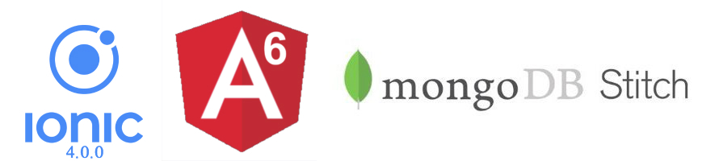

# IonicEmployeesStitchMongoDB

**If you want to help me to keep contributing to open source with projects, examples, plugins,... help me and buy me a coffee.**

<a href="https://www.buymeacoffee.com/h6WVj4HcD" target="_blank"></a>

Sample project that shows how to build a Employees List with Angular, Ionic 4 and Stitch MongoDB.

This project was generated with [Angular CLI](https://github.com/angular/angular-cli) version 1.7.4.

This project shows you how to:

    * Use Stitch MongoDB with Ionic 4.
    * Email/Password Authentication Stitch MongoDB.
    * Show employees list.
    * Filter employees list.
    * Show employee detail.
        * Show employee projects.
        * Call employee.
        * Send email.
        * Send message.
    * Show project participants.
    * Show organization.
    * Employee can manage his events.
        * Employee can add, update and delete his own events.
    * Show company products.
    * Employee can manage his notes.
        * Employee can:
            * Add note.
            * Update note.
            * Delete note.
            * Archive note.
            * Delete all notes.
            * Archive all notes.
            * Create note copy.
            * Tag note.


Technologies: Angular, Ionic, Stitch MongoDB, TypeScript.



## App Example


## Running

Before you go through this example, you should have at least a basic understanding of Ionic concepts. You must also already have Ionic installed on your machine.

* Test in localhost:

To run it, cd into `ionic-employees-stitch-mongodb` and run:

```bash
npm install
ionic serve
```

## Requirements

* [Node.js](http://nodejs.org/)
* [Ionic](https://ionicframework.com/getting-started#cli)
